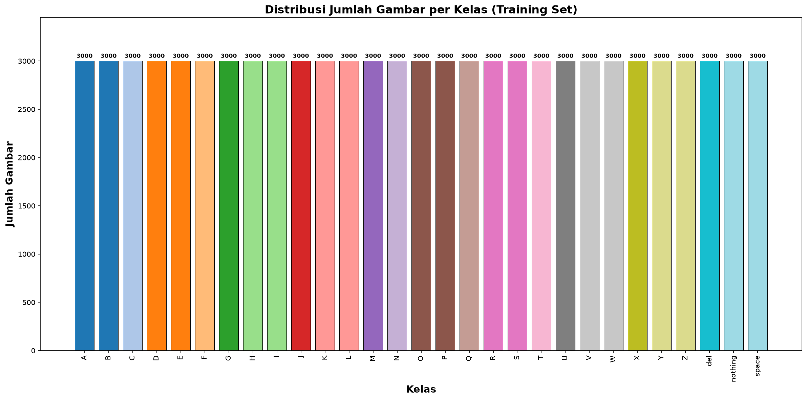
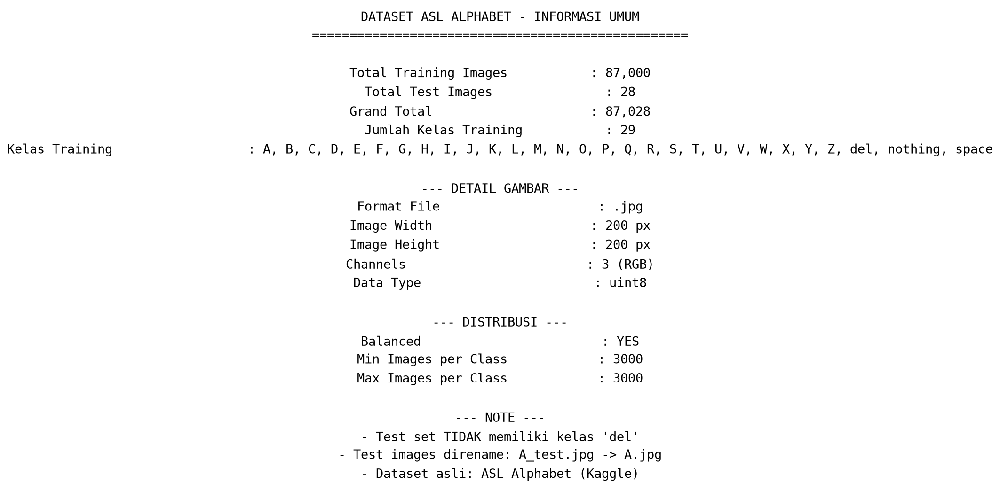

# Dokumentasi Dataset ASL Alphabet

## Ringkasan Dataset

| Metrik | Nilai |
|--------|-------|
| Total Training Images | 87.000 |
| Total Test Images | 28 |
| Grand Total | 87.028 |
| Jumlah Kelas | 29 |
| Format Gambar | .jpg |
| Ukuran Gambar | 200 x 200 px |
| Color Channels | 3 (RGB) |
| Balanced Dataset | Ya |

> Dataset ASL Alphabet berisi 87.028 gambar gestur tangan yang merepresentasikan huruf A-Z serta gesture khusus: `del`, `nothing`, dan `space`. Dataset diambil dari Kaggle.

## Daftar Kelas (29 Kelas Training)

| Kelas | Jumlah Gambar | Keterangan |
|-------|--------------|-----------|
| A | 3.000 | Huruf A |
| B | 3.000 | Huruf B |
| C | 3.000 | Huruf C |
| D | 3.000 | Huruf D |
| E | 3.000 | Huruf E |
| F | 3.000 | Huruf F |
| G | 3.000 | Huruf G |
| H | 3.000 | Huruf H |
| I | 3.000 | Huruf I |
| J | 3.000 | Huruf J |
| K | 3.000 | Huruf K |
| L | 3.000 | Huruf L |
| M | 3.000 | Huruf M |
| N | 3.000 | Huruf N |
| O | 3.000 | Huruf O |
| P | 3.000 | Huruf P |
| Q | 3.000 | Huruf Q |
| R | 3.000 | Huruf R |
| S | 3.000 | Huruf S |
| T | 3.000 | Huruf T |
| U | 3.000 | Huruf U |
| V | 3.000 | Huruf V |
| W | 3.000 | Huruf W |
| X | 3.000 | Huruf X |
| Y | 3.000 | Huruf Y |
| Z | 3.000 | Huruf Z |
| del | 3.000 | Gesture Delete |
| nothing | 3.000 | Gesture Nothing |
| space | 3.000 | Gesture Space |

> **Catatan:** Kelas `del` hanya ada di training set, tidak ada di test set.

## Sample Gambar


## Distribusi Kelas



## Informasi Gambar Detail



## Struktur Folder

```
D:\TA Mesin\
├── data/
│   ├── train/         ← 29 folder kelas (A-Z, del, nothing, space)
│   ├── test/          ← 28 gambar (A-Z + nothing + space)
│   └── processed/     ← hasil ekstraksi fitur (akan diisi)
└── 1_eksplorasi_dataset/
    ├── code/
    │   └── eksplorasi_dataset.py    ← code + penjelasan inline
    ├── images/
    │   ├── class_distribution.png
    │   ├── sample_grid.png
    │   └── dataset_info.png
    └── dokumentasi.md               ← dokumentasi ini
```

## Preprocessing Plan

- **Resize**: Tidak diperlukan — seluruh gambar sudah seragam 200x200 px.
- **Normalisasi**: Pixel values 0-255 &rarr; 0-1.
- **Augmentasi**: Akan ditentukan setelah baseline training.
- **Feature Extraction**: MediaPipe Hands &rarr; 21 landmarks (x, y, z) &rarr; 63 fitur per gambar.
- **Split**: Train 80% / Validation 10% / Test 10% (stratified).

## Catatan

- Dataset ini sudah ***perfectly balanced*** — setiap kelas memiliki tepat 3.000 gambar.
- Test set memiliki 28 gambar (tidak ada kelas `del`).
- Semua gambar berformat JPG RGB 200x200 pixel.
- Dataset asli: [ASL Alphabet (Kaggle)](https://www.kaggle.com/databases/grassknoted/asl-alphabet)
