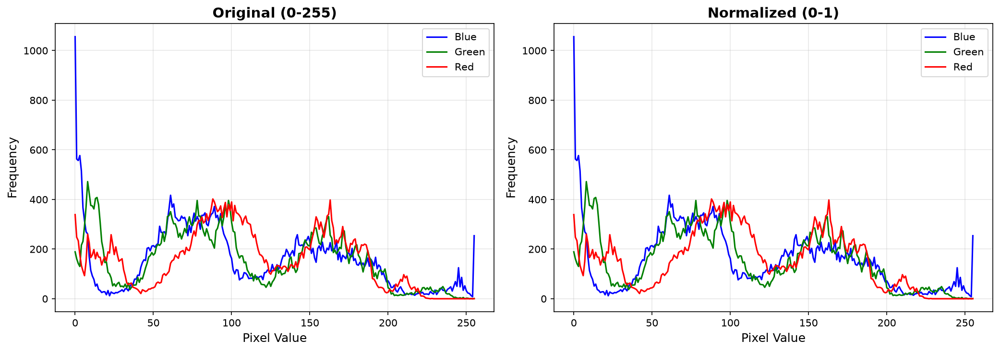

# Dokumentasi Preprocessing Dataset ASL Alphabet

## Tujuan
Melakukan normalisasi dan augmentasi pada dataset sebelum ekstraksi fitur.

## Dataset Info
| Metrik | Nilai |
|---|---|
| Jumlah Kelas | 29 |
| Ukuran Gambar | 200 x 200 px |
| Format | JPG RGB |
| Total Sample | 87 gambar (29 kelas) |

## Preprocessing Steps

### 1. Normalisasi Pixel

Normalisasi pixel dilakukan dengan membagi setiap nilai pixel dengan 255.0,
sehingga range nilai berubah dari [0, 255] menjadi [0.0, 1.0].

Tujuan:
- Mempercepat konvergensi model saat training
- Menghindari dominasi fitur dengan skala besar
- Stabilisasi gradient descent

### 2. Augmentasi Data

Augmentasi data dilakukan untuk menambah variasi dataset dan mengurangi overfitting.
Parameter augmentasi:
- Rotasi: +-15 derajat
- Width Shift: +-10% dari lebar gambar
- Height Shift: +-10% dari tinggi gambar
- Zoom: 0.9x - 1.1x

Semua augmentasi menggunakan borderMode=cv2.BORDER_CONSTANT (isi hitam).

### 3. Progress Plan

| Preprocessing Step | Status | Keterangan |
|---|---|---|
| Resize | Tidak diperlukan | Semua gambar sudah 200x200 px |
| Normalisasi | Diterapkan | Pixel 0-255 -> 0-1 (float32) |
| Augmentasi | Diterapkan | Rotasi, shift, zoom (acak) |
| Feature Extraction | Belum | Akan dilakukan di tahap selanjutnya |

## Visualisasi Hasil

### Perbandingan Original vs Normalized vs Augmented

*Setiap baris = 1 kelas. Kolom: Original -> Normalized -> Augmented*

### Histogram Normalisasi

*Histogram pixel value sebelum (kiri) dan sesudah (kanan) normalisasi*

## Catatan
- Normalisasi dilakukan per gambar (tidak ada global statistics).
- Augmentasi dilakukan secara acak dengan seed berbeda tiap run.
- Gambar augmented tidak disimpan ke disk, diterapkan real-time saat training nanti.
- Setelah preprocessing selesai, akan dilanjutkan ke Feature Extraction dengan MediaPipe.
